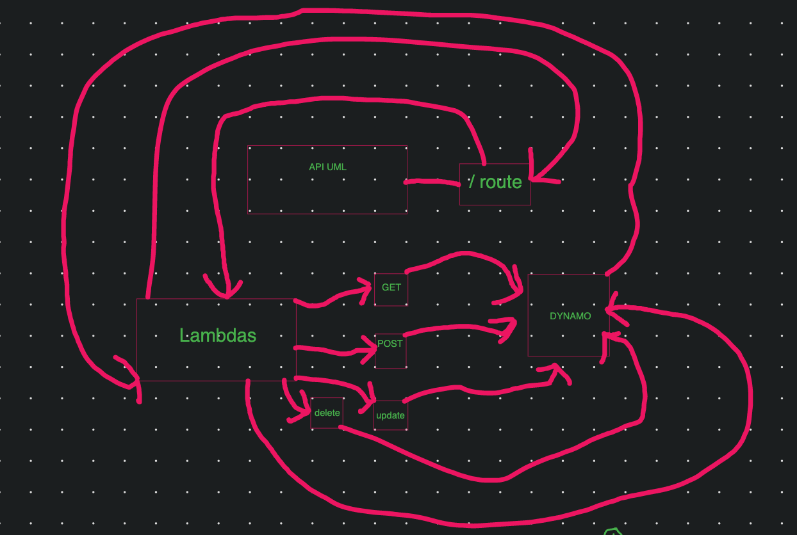

# LAB - lab 18

## Project: AWS: API, Dynamo and Lambda

### Author: Kale Lesko

### Documentation

- the root url is https://vyq2j7poka.execute-api.us-west-2.amazonaws.com/create
- there is only 1 route the "/create" but it calls the CRUD lambdas for easy testing its all on that
- inputs they require are a json object on the post route the object looks like
- {
  "body": "{\"name\":\"YOURINPUT\",\"phone\":\"YOUR-INPUT\"}"
  }
- the output object
- {
  "statusCode": 200,
  "body": "{}"
  }

### Links and Resources

- [ci/cd](https://github.com/Saynka/aws-rest/actions) (GitHub Actions)
<!-- - [back-end server url](http://xyz.com) (when applicable) -->
- [front-end application](https://vyq2j7poka.execute-api.us-west-2.amazonaws.com/create) (aws)

### Setup

.
├── LICENSE
├── README.md
├── create
│ ├── create.schema.js
│ ├── create.zip
│ ├── index.js
│ ├── package-lock.json
│ └── package.json
├── delete
│ ├── delete.schema.js
│ ├── delete.zip
│ ├── index.js
│ ├── package-lock.json
│ └── package.json
├── read
│ ├── index.js
│ ├── package-lock.json
│ ├── package.json
│ ├── read.schema.js
│ └── read.zip
└── update
├── index.js
├── package-lock.json
├── package.json
├── update.schema.js
└── update.zip

#### `.env` requirements (where applicable)

- `Secrects, only applicable if using this in AWS`

#### How to initialize/run your application (where applicable)

- `you need postman or httpie to check if these are working`

<!-- #### How to use your library

- ` -->

#### Tests

- tests are ran in a propriatary environment in AWS

####

#### UML

